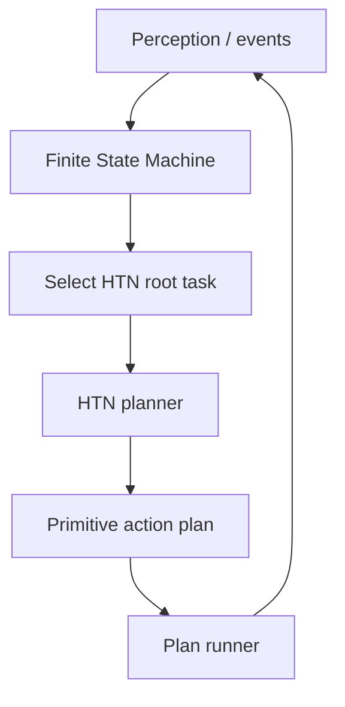
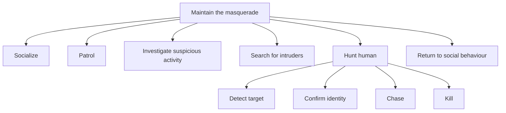
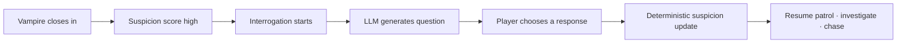

# Vampires (Don't) Bite Me 🎭

[](https://www.repostatus.org/#inactive)
[](https://unity.com/)
[](https://learn.microsoft.com/dotnet/csharp/)
[](https://globalgamejam.org/)
[](https://globalgamejam.org/)
[](#)
[](#)

Retro first-person stealth horror set in a masquerade ball that turns into a
massacre. Everyone at the party wears a mask, which is the only reason the
protagonist is still alive: the way out is to be mistaken for one of them
until dawn.

Built for Global Game Jam 2026 under the theme **Mask**, as a 2D
side-scroller. It is now a solo remake in the shape of a Doom-like first
person game, keeping deception and survival at the centre while abandoning
the original perspective.

**Status:** post-jam solo remake, in progress.

## Overview

The protagonist leaves the ballroom for a few minutes. The music stops,
screams cut through the mansion, and by the time they return the vampires
have begun slaughtering the guests. The mansion is now a hunting ground, and
surviving means deceiving the vampires, hiding your identity and escaping
before sunrise.

The design leans on stealth, exploration, enemy perception, resource
management and environmental storytelling, and on the psychological pressure
of passing as something you are not. Unlike most retro shooters, combat is
not the point.

## Theme interpretation

The jam theme was *Mask*. Rather than a cosmetic object, the project treats
the mask as the thing identity is negotiated with: survival, deception,
appearance against reality, social roles, hidden intention and fear. It is a
mechanic and a narrative device at once, because wearing one is what lets the
player temporarily become one of them.

## Gameplay

The loop is exploration under pressure: search the mansion for keys and
resources, find new masks, blend in with the vampires, avoid drawing
suspicion, hide when blending stops working, unlock new areas, and either
escape or hold out until dawn.

### The mask system

Masks are the central mechanic, and they are consumable rather than
permanent.

| Rule                                    | Consequence                                |
|-----------------------------------------|---------------------------------------------|
| Masks deteriorate with use              | Disguise is a resource, not a state         |
| Some vampires are harder to fool        | The same mask does not work everywhere      |
| Suspicious behaviour raises detection   | How you move matters as much as what you wear |
| A broken mask exposes the player        | Failure is immediate, not gradual           |

Deciding when to wear a mask and when to preserve it is the main strategic
choice the game asks for.

## Enemy AI

The vampires are built around perception, suspicion and planning rather than
scripted encounters, and this is the part of the project meant to carry the
most technical weight.

### Architecture

Decision-making is a hybrid: a macro **Finite State Machine** decides which
mode a vampire is in, and that mode selects the root task for a custom
**Hierarchical Task Network** planner, which decomposes it into primitive
actions against the current world state.



| Vampire state | Root task            |
|---------------|----------------------|
| `Social`      | MaintainMasquerade   |
| `Suspicious`  | InvestigateSuspicion |
| `Hunting`     | HuntHuman            |
| `Chasing`     | ChaseAndKill         |
| `Returning`   | ReturnToPost         |

The supporting pieces are a perception system covering field of view, line of
sight and proximity; a world state blackboard the planner reads; a memory
holding the last known player position and past suspicious events; navigation
through the mansion; and the plan runner that executes the sequence.

### Task hierarchy



The player's mask feeds this directly by writing into the world state: a
valid mask lowers suspicion, a damaged one raises it, a broken one exposes
the player outright. Running, entering restricted areas or lingering too
close to a vampire can trigger questioning or pursuit on its own.

Planned behaviours include patrol, field-of-view and line-of-sight detection,
a suspicion score, investigation, chase and search states, and memory of
where the player was last seen.

### Dialogue experiment

A later experiment may add an LLM-assisted interrogation for the moment a
suspicious vampire closes in while the player is masked. The boundary is
deliberate: the model would generate the contextual questions and social
pressure, while suspicion scoring and every gameplay outcome stay
deterministic and owned by the FSM, the HTN, perception and world state. No
model authority over detection, death, chase or win and loss.



This sits past the vertical slice, after the stealth, mask and HTN systems
are playable.

## Exploration

The mansion opens up gradually as the player finds keys, masks, documents,
hidden passages and survival resources. The environment carries the story
rather than cutscenes.

## Artistic direction

The 2D side-scroller was replaced by a retro Doom-like presentation: pixel-art
inspired rendering at low resolution, billboard enemies with directional
sprites, low-poly environments, stylised lighting and atmospheric fog. The
aim is the feel of a 90s shooter pointed at stealth instead of combat.

Rendering targets a fixed internal resolution of **320×180**, with 426×240 as
an alternative, at 16:9 with integer pixel scaling. The window scales to
modern displays while keeping the original pixel density. PC is the target,
with WebGL a possibility.

## Technical direction

Work is organised into modular systems: first-person controller, interaction,
inventory, the mask system, vampire AI with its macro state machine and HTN
planner, suspicion, saving, dialogue triggers, environmental events and scene
management.

Characters are billboard sprites with directional animation; large props and
architecture use simple low-poly models, which reads better for depth and
avoids the artefacts pure billboarding produces at close range.

### Technologies

| Area          | Tools                  |
|---------------|------------------------|
| Engine        | Unity                  |
| Programming   | C#                     |
| Art           | Blender, Aseprite      |
| Audio         | FMOD, BeepBox          |
| Documentation | Notion, Trello, Canva  |

## Controls

| Action              | Key         |
|---------------------|-------------|
| Move                | `WASD`      |
| Look around         | Mouse       |
| Interact            | `E`         |
| Use / change mask   | `Q`         |
| Sprint              | `Left Shift`|
| Crouch              | `Left Ctrl` |
| Pause               | `Esc`       |

## Running it

```bash
git clone https://github.com/AndersonGACFilho/Vampires--Don-t--bite-me.git
```

Open the project in Unity Hub with editor **6000.3.5f1**, load the main scene
and press Play.

## Roadmap

Playable mansion prototype, then the mask and suspicion systems, then the
vampire AI in order: macro FSM, HTN planner, root task selection. After that
inventory, exploration mechanics, environmental storytelling and the final
chase sequence, towards a public demo and an itch.io release candidate. The
LLM interrogation experiment comes last.

Current stage: the jam prototype is preserved, the gameplay redesign and the
new artistic direction are under way, the AI systems and the environment are
being rebuilt, and a first playable prototype is in progress.

Screenshots, development GIFs, AI demonstrations and playable builds will be
added here as they exist.

## Credits

The original jam version was made by five people over 48 hours at Coletivo
Centopeia. Anderson was solely responsible for programming and gameplay
implementation.

| Contributor        | Role                        |
|--------------------|-----------------------------|
| Anderson Gonçalves | Programming and game design |
| Ana Paula          | Art and design              |
| João Pedro         | Art and design              |
| Eduarda            | Art and design              |
| Dayane Noleto      | Art and design              |

Since the jam ended the project has continued as a solo remake, with
Anderson on programming, gameplay, game and technical design, AI systems,
architecture and implementation.

## Links

- [Game Design Document](https://www.notion.so/Modelo-Game-Design-Document-GDD-2f3e7aeb5ebf802e9f67de17ad16b96d)
- [Moodboard](https://www.canva.com/design/DAG_c6LGVcg/xwptMcac3JszZ9BqyNh9vg/edit)
- [Trello](https://trello.com/invite/b/69767438a75ab1358604a2ac/ATTI3a92b1e4424a68ca56f1d045ba90d96cE1C3F458/global-game-jam-mascaras)
- [Development notes](https://docs.google.com/document/d/1gSsfs96pag5IdlHf_3TUngOn9RLWpy8zHs_kwGrAUrE)

## Acknowledgements

Thanks to Global Game Jam, to Coletivo Centopeia, to the original jam team
and to everyone who took part in GGJ 2026. Without the jam this project would
not exist.
